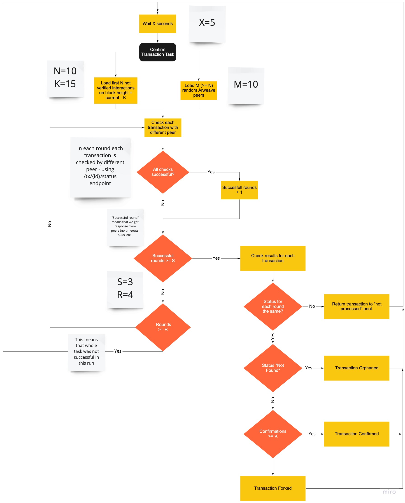

# RedStone SmartWeave Gateway

RedStone SmartWeave Gateway - a fast and reliable way to
load [SmartWeave](https://github.com/redstone-finance/redstone-smartcontracts) transactions.

1. fast - load your contract interactions in seconds, not minutes!
2. reliable - built-in protection against forks and corrupted transactions

- [RedStone SmartWeave Gateway](#redstone-smartweave-gateway)
  - [Reasoning](#reasoning)
  - [Our solution](#our-solution)
  - [Benchmarks](#benchmarks)
  - [Corrupted transactions](#corrupted-transactions)
  - [Public access](#public-access)
  - [RedStone SmartContracts SDK integration](#redstone-smart-contracts-sdk-integration)
  - [Installation](#installation)
  - [Running](#running)
  - [Running (Docker)](#running--docker-)
  - [HTTP API Reference](#http-api-reference)
    - [Contracts endpoint](#contracts-endpoint)
    - [Interactions endpoint](#interactions-endpoint)
  - [Further development](#further-development)

### Reasoning

SmartWeave is an Arweave-based protocol for lazy-evaluated smart contracts. Each interaction with a contract is saved as
a separate Arweave transaction. In order to evaluate the contract state, all of its interactions must be loaded first.

In the case of typical content getting a corrupted or not confirmed transaction is not a severe issue, while any
inconsistency could be extremely harmful to smart contracts, leading to a potential financial loss due to the corrupted
state of token contracts.

The current available solution ("general-purpose" Arweave gateway) has some flaws:

1. **It doesn't scale well**  
   The interactions can be loaded using the GQL endpoint, which can return only 100 interactions in a single
   batch/query. At the time of writing, each query takes from ~300ms to ~5 seconds.  
   For our [loot contract](https://github.com/redstone-finance/smartweave-loot) (that has 9821 interactions) it means
   that loading all the interactions takes around 1 minute.  
   There are contracts with much more interactions - the biggest one has over 280K interactions - loading all the
   interactions for this contract takes ~3 hours. This clearly shows that the current solution scales poorly and is a
   first big obstacle for a wider SmartWeave contracts adoption.

2. **Corrupted transactions**  
   The Arweave gateway GQL endpoint tends to return corrupted transactions - i.e. such transactions, that are not part
   of any Arweave block - probably due to some caching issues/bug in the Arweave
   gateway (https://discord.com/channels/357957786904166400/756557551234973696/891254856638160917)
   The state evaluated with such corrupted transactions is obviously flawed. In case of our loot contract - 25
   transactions returned by the Arweave gateway are corrupted.

3. **Forked blocks problem**  
   No protection against transactions from forked blocks.

All the issues also make things like caching the contract state very risky - as you have no guarantee that the state has
been evaluated for proper inputs.

### Our solution

We combine data from both the Arweave Gateway and the Arweave peers directly, perform transactions validation, store and
index them in a dedicated database.


The RedStone Gateway consists of three main tasks:

1. The Sync Arweave Peers Task - this task is responsible for loading information about currently active peers and
   ranking them by the amount of synced blocks and response times.
2. The Sync Transactions Task - this task is responsible for loading and indexing SmartWeave interaction transactions
   from the newly mined blocks
3. Confirm Interactions Task - the most complicated task, responsible for confirming transactions.

   - It takes the first PARALLEL_REQUESTS, non-confirmed transactions with block height lower than (current_network_height -
     MIN_CONFIRMATIONS).
   - For each set of the selected 'interactionsToCheck' transactions it makes TX_CONFIRMATION_SUCCESSFUL_ROUNDS query
     rounds (to randomly selected at each round peers).
   - Only if we get TX_CONFIRMATION_SUCCESSFUL_ROUNDS within TX_CONFIRMATION_MAX_ROUNDS AND response for the given
     transaction is the same for all the successful rounds - the "confirmation" info for a given transaction is updated in the database.



### Benchmarks

Tested for block height range: 0 - 831901. Benchmarks source can be
found [here](https://github.com/redstone-finance/redstone-sw-gateway/tools/gateway-benchmark.ts)
and [here](https://github.com/redstone-finance/redstone-sw-gateway/tools/gateway-benchmark-comparison.ts).

| Contract                                               |     Project     | <sub>Interactions</sub> |   <sub>Arweave GW</sub> | <sub>RedStone GW</sub> | <sub>RedStone GW(cache)</sub> |
| ------------------------------------------------------ | :-------------: | ----------------------: | ----------------------: | ---------------------: | ----------------------------: |
| <sub>LkfzZvdl_vfjRXZOPjnov18cGnnK3aDKj0qSQCgkCX8</sub> |      Kyve       |                  281129 |  <sub>3h 7min 39s</sub> |   <sub>1 min 27s</sub> |                 <sub>8s</sub> |
| <sub>l6S4oMyzw_rggjt4yt4LrnRmggHQ2CdM1hna2MK4o_c</sub> |      Kyve       |                  194326 | <sub>2h 32min 54s</sub> |         <sub>46s</sub> |                 <sub>6s</sub> |
| <sub>B1SRLyFzWJjeA0ywW41Qu1j7ZpBLHsXSSrWLrT3ebd8</sub> |      Kyve       |                   93098 |    <sub>38min 22s</sub> |         <sub>16s</sub> |                 <sub>3s</sub> |
| <sub>cETTyJQYxJLVQ6nC3VxzsZf1x2-6TW2LFkGZa91gUWc</sub> |       Koi       |                   22403 |     <sub>3min 15s</sub> |          <sub>2s</sub> |                 <sub>1s</sub> |
| <sub>QA7AIFVx1KBBmzC7WUNhJbDsHlSJArUT0jWrhZMZPS8</sub> |       Koi       |                   12228 |     <sub>1min 25s</sub> |          <sub>1s</sub> |              <sub>582ms</sub> |
| <sub>SJ3l7474UHh3Dw6dWVT1bzsJ-8JvOewtGoDdOecWIZo</sub> |     Pianity     |                   10924 |     <sub>1min 13s</sub> |          <sub>1s</sub> |              <sub>670ms</sub> |
| <sub>NwaSMGCdz6Yu5vNjlMtCNBmfEkjYfT-dfYkbQQDGn5s</sub> |       Koi       |                   10137 |      <sub>1min 5s</sub> |          <sub>1s</sub> |              <sub>491ms</sub> |
| <sub>Daj-MNSnH55TDfxqC7v4eq0lKzVIwh98srUaWqyuZtY</sub> | RedStone - loot |                    9821 |      <sub>1min 1s</sub> |       <sub>834ms</sub> |              <sub>358ms</sub> |
| <sub>-8A6RexFkpfWwuyVO98wzSFZh0d6VJuI-buTJvlwOJQ</sub> |   ArDrive PST   |                    4786 |          <sub>20s</sub> |       <sub>710ms</sub> |              <sub>190ms</sub> |
| <sub>usjm4PCxUd5mtaon7zc97-dt-3qf67yPyqgzLnLqk5A</sub> |    Verto PST    |                    1041 |           <sub>3s</sub> |       <sub>459ms</sub> |              <sub>142ms</sub> |


### Corrupted transactions

List of first 15 contracts with the highest number of corrupted transactions. Corrupted transactions are transactions
that are not part of any block - but they are still returned by the Arweave GQL endpoint. This creates a huge problem
when evaluating the state - especially in the case of PSTs and `transfer` interactions.  
You can read more about these
issues [here](https://discord.com/channels/357957786904166400/756557551234973696/827281270722527293),
[here](https://discord.com/channels/357957786904166400/756557551234973696/891254856638160917)
and [here](https://discord.com/channels/357957786904166400/358038065974870018/903427357409439755).

| Contract                                     | Corrupted |
| -------------------------------------------- | --------: |
| Daj-MNSnH55TDfxqC7v4eq0lKzVIwh98srUaWqyuZtY  |        25 |
| -8A6RexFkpfWwuyVO98wzSFZh0d6VJuI-buTJvlwOJQ  |         9 |
| 1TFZeEewEgUpqT5i2dsZSIRKJq3h1C7ZVi-gE8G-W6U  |         8 |
| usjm4PCxUd5mtaon7zc97-dt-3qf67yPyqgzLnLqk5A  |         8 |
| wXotIq_fSPvYWR12h6IS-kfD18Y5jkr4UPPp15e0wo0  |         7 |
| NwaSMGCdz6Yu5vNjlMtCNBmfEkjYfT-dfYkbQQDGn5s  |         6 |
| 3NQQlLebRbq32Rtdxf_xaiWCJcQZNmoLvmOxLclGRcU  |         5 |
| LppT1p3wri4FCKzW5buohsjWxpJHC58_rgIO-rYTMB8  |         5 |
| QA7AIFVx1KBBmzC7WUNhJbDsHlSJArUT0jWrhZMZPS8  |         4 |
| gTT7\_-8nrB1HKyJrPoUiku8-5aL3_wva5BJEn8sUCl4 |         4 |
| SJ3l7474UHh3Dw6dWVT1bzsJ-8JvOewtGoDdOecWIZo  |         4 |
| K9Lb5WzRHxGyQqZVKL-ckBcnwtEouEBOlphKNmLhHtY  |         4 |
| k-3vYDcwrusBtnouFXh6QlRvwfH57lLvnG8jnf_q1EM  |         4 |
| hFhD2XG0LNKQTo4WCMfhFbD2ssxMn1vOyzwZt0qiJI4  |         3 |
| o-qJmQ4B0d6TnyA_awjhiBdiq0O4Vt_dNWU3pTnhTu8  |         2 |

### Public access

RedStone SmartWeave Gateway is currently publicly available
under [https://gateway.redstone.finance/](https://gateway.redstone.finance/).
The contracts scanner web app is available under [https://scanner.redstone.tools/](https://scanner.redstone.tools/).

### RedStone SmartContracts SDK integration

We've prepared a dedicated plugin for the RedStone SmartContracts SDK that allows to easily connect and load
interactions from the RedStone SmartWeave Gateway. More
details [here](https://github.com/redstone-finance/redstone-smartcontracts#using-the-redstone-gateway).

### Installation

1. `yarn install`
2. `yarn build`

### Running

To run gateway in production:

1. Create a file `.secrets/.env` with a `DB_URL` property with PostgreSQL connections string,
   eg: `DB_URL=postgresql://<user>:<password>@<db-host>:<db-port>/<database-name>`

2. Run gateway with `yarn start:prod`.  
   You can pass the `env_path` param with path to the `.env` file, eg:  
   `yarn start:prod --env_path .secrets/.env`

To run gateway locally:

1. Create a file `.secrets/local.env` with a `DB_URL` property with PostgreSQL connections string,
   eg: `DB_URL=postgresql://<user>:<password>@<db-host>:<db-port>/<database-name>`

2. Run gateway with `yarn start:local`.

### Running (Docker)

1. build the docker image - run script `docker-build.sh`
2. run the docker image - run script `docker-run.sh`

### HTTP API Reference

#### Contracts endpoint

`/gateway/contracts?page=<page>` - returns the list of all the currently registered contracts.  
Result is ordered by `[last_interaction_height DESC, count(interaction) DESC]`

Parameters:

1. `type` [optional] - filter records by contract type. If not set, all types of contracts are returned.
   1. `pst`
   2. `other`
2. `page` [optional] - page, e.g.: `gateway/contracts?page=3`. If not set, first page is returned by default.
3. `limit` [optional] - amount of interactions per single page

Response:

```json5
{
  "paging": {
    // paging info object
    "total": 4145,
    // total number of elements
    "limit": 100,
    // elements per page
    "items": 100,
    // elements on current page
    "page": 1,
    // page number
    "pages": 42
    // total amount of pages
  },
  "contracts": [
    // array of "contract" objects
    {
      "confirmed": "10753",
      // amount of confirmed interactions
      "contract": "NwaSMGCdz6Yu5vNjlMtCNBmfEkjYfT-dfYkbQQDGn5s",
      // contract tx id
      "owner": "DymtKHHegWz-HWrNnOL12Rxz_7dLrY2R3wVwTFE8788",
      // contract owner address
      "type": "pst",
      // contract type (pst/other)
      "token": "KOI",
      // contract token symbol
      "interactions": "10763",
      // total amount of interactions
      "last_interaction_height": 835229,
      // last synced interaction block height
      "corrupted": "6",
      // amount of corrupted interactions
      "total": "4145"
      // total amount of contracts (helper)
    }
    (...)
  ]
}
```

Examples:

1. `curl https://gateway.redstone.finance/gateway/contracts`
2. `curl https://gateway.redstone.finance/gateway/contracts?page=6`

#### Interactions endpoint

`/gateway/interactions?contractId=<contract_id>&confirmationStatus=<confirmation_status>&from=<block_height_from>&to=<block_height_to>&page=<page>`

- returns a list of a given contract interactions, ordered by `[block_height ASC]`.

Parameters:

1. `contractId` - tx id of the contract to load the interactions for
2. `page` [optional] - page, e.g.: `gateway/interactions?page=3`. If not set, first page is returned by default.
3. `limit` [optional] - amount of interactions per single page
4. `confirmatinStatus` [optional], e.g.: `gateway/interactions?confirmationStatus=corrupted`. If not set, loads all the
   contract interactions.
   1. `confimed` - loads only the `confirmed` contract interactions
   2. `corrupted` - loads only the `corrupted` contract interactions
   3. `not_corrupted` - loads both `confirmed` and `not processed` interactions
5. `totalCount` [optional], e.g.: `gateway/interactions?totalCount=true`. If set to `true` endpoint returns
   interactions' count for each of confirmation statuses (confirmed | corrupted | forked | not_processed)

Response:

```json5
{
  // paging info object
  "paging": {
    "total": 4145,
    // total number of elements
    "limit": 100,
    // elements per page
    "items": 100,
    // elements on current page
    "page": 1,
    // page number
    "pages": 42
    // total amount of pages
  },
  // summary of interactions count based on confirmation status of each interaction
  "total": {
    "confirmations": {
      "confirmed: "
      56
      ",
      "corrupted": "2",
      "not_processed": "1",
      "forked": "0"
    }
  },
  // array of "interaction" objects
  "interactions": [
    {
      "confirmations": "58244,58244,58244",
      // amount of confirmations returned from each confirming peer
      "confirming_peers": "94.130.135.178,165.227.34.27,23.88.65.188",
      // peers who confirmed this interaction
      "interaction": {
        // a full interactions object, compatible with SmartWeave protocol GQLNodeInterface
        "id": "RaW_er2EidTFdaNXm4D3qRxBZWHN1ofGiYxta-QjDEY",
        "fee": {
          "winston": "1473297"
        },
        "tags": [
          {
            "name": "App-Name",
            "value": "SmartWeaveAction"
          },
          {
            "name": "App-Version",
            "value": "0.3.0"
          },
          {
            "name": "Contract",
            "value": "Daj-MNSnH55TDfxqC7v4eq0lKzVIwh98srUaWqyuZtY"
          },
          {
            "name": "Input",
            "value": "{\"function\":\"generate\"}"
          },
          {
            "name": "Signing-Client",
            "value": "ArConnect"
          },
          {
            "name": "Signing-Client-Version",
            "value": "0.3.5"
          }
        ],
        "block": {
          "id": "0ISp2BqDA9nE5eljZw8jcbJvzJrb9a0Yw4tYBM93v3Y1TGSJIzBIqjwfEQ7-jy1H",
          "height": 769067,
          "timestamp": 1631571122
        },
        "owner": {
          "address": "I-5rWUehEv-MjdK9gFw09RxfSLQX9DIHxG614Wf8qo0"
        },
        "parent": null,
        "quantity": {
          "winston": "0"
        },
        "recipient": ""
      },
      "status": "confirmed"
      // confirmation status of this interaction (not_processed | confirmed | corrupted | forked)
    }
  ]
}
```

Examples:

1. `https://gateway.redstone.finance/gateway/interactions?contractId=Daj-MNSnH55TDfxqC7v4eq0lKzVIwh98srUaWqyuZtY` -
   loads all contract interactions
2. `https://gateway.redstone.finance/gateway/interactions?contractId=Daj-MNSnH55TDfxqC7v4eq0lKzVIwh98srUaWqyuZtY&page=2`
   - loads all contract interactions, shows 2nd. page
3. `https://gateway.redstone.finance/gateway/interactions?contractId=Daj-MNSnH55TDfxqC7v4eq0lKzVIwh98srUaWqyuZtY&page=2&confirmationStatus=confirmed`
   - loads only confirmed contract interactions, shows 2nd. page
4. `https://gateway.redstone.finance/gateway/interactions?contractId=Daj-MNSnH55TDfxqC7v4eq0lKzVIwh98srUaWqyuZtY&confirmationStatus=confirmed&from=820000&to=831901`
   - loads only confirmed contract interaction from block height 820000 to block height 831901

### Further development

1. An option to define the observed contracts - so that each project could run its own instance dedicated to its
   contracts.
2. Scale the infrastructure, create backup instances, etc.
3. A form of decentralization with disputes/voting on challenged responses.
4. Custom network of Arweave nodes, that will listen on and index only SmartWeave interaction transactions (probably
   with the help of the customized Vartex gateway).
5. Even better protection against forks - analyzing blocks history
6. As the amount of data being transferred is rather huge - consider moving from json to protobuf?
7. A fully featured web app that will allow browsing and interacting with contracts
